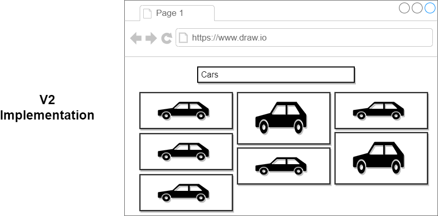
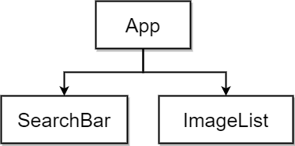
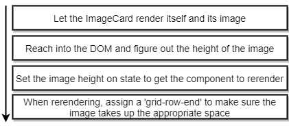

# About this Project

## How it should look like

## What it does

The app shows a list of image which are rendered based on their independent sizing in a nicely way. There can be searched for any sort of images. The images are accessed over the `unsplash API`.

## App Structure:

## How to Render Image nicely
